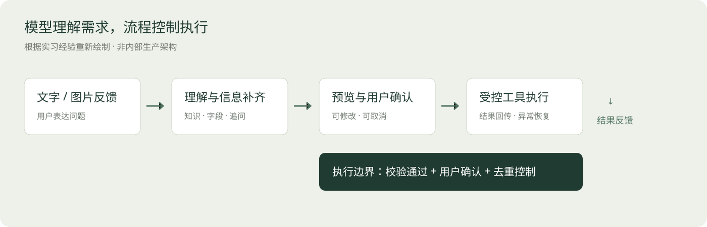
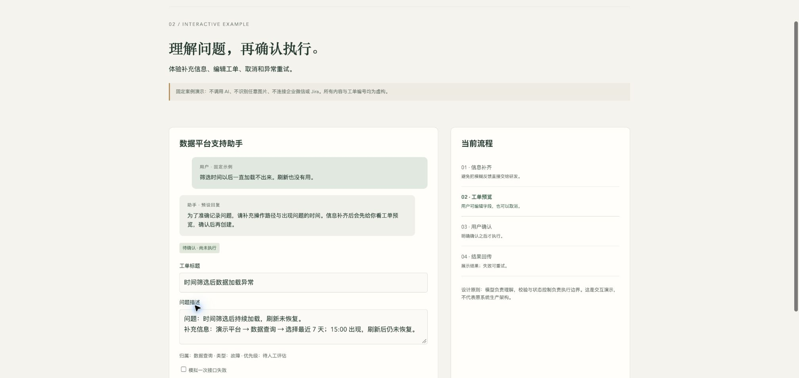

[在线项目介绍](https://capybarra1.github.io/support-agent-demo/) · [GitHub 主页](https://github.com/capybarra1)

# 企业客服与工单 Agent

> 实习落地经历｜公开交付为重新制作的案例与交互示例

## 问题：答疑和工单创建之间存在断点

内部数据平台用户会通过文字与截图报告问题。人工需要判断是咨询还是故障、追问复现信息、整理字段、创建工单并反馈状态。重复咨询和信息不足会增加沟通成本。

## 我的职责

独立负责机器人开发，并负责生产化架构评审、资源申请、安全测试、UAT 与上线推进。搭建过程中需要与相关角色完成资源配置、测试和审批协作。我也整理了回复规范、运营与交接说明，让系统上线后有维护路径。

## 公开流程

消息进入 → 结合知识回答或识别故障 → 追问缺失信息 → 生成结构化工单预览 → 用户确认 → 调用受控接口 → 回传结果。

模型用于理解语言和截图；固定流程负责必要字段、确认状态和执行。公开图只表达组件职责，不展示企业域名、内部拓扑或真实配置。

## 为什么先预览，再确认？

AI 识别错误如果直接变成工单，会把成本转移给开发团队。预览允许用户修改标题、描述和问题归属；确认之后才执行。取消也应是正常路径。消息重试与用户连续点击还需要防止重复处理。

## 可点击演示

打开 `demos/support-agent.html`，体验“补充信息 → 编辑预览 → 确认生成演示工单 → 查询状态”，也可以取消或模拟接口失败后重试。

**演示范围：**纯前端固定案例，不调用模型、不识别任意图片、不创建真实 Jira 工单、不连接企业微信。它用于展示产品交互与状态控制。实习系统已完成的能力与本次公开演示不能混为一谈。

## 实习中的工程与交付思考

- 流式回复：先反馈处理状态，再逐步给出内容，减少长等待中的不确定感。
- 消息去重：对回调重试与重复消息处理，防止相同输入反复执行。
- 图片输入：截图帮助描述问题，但不能把图像识别结果当成确定的故障根因。
- 生产交付：从开发环境到 UAT 和上线，资源、权限、回调、日志与验收要共同就绪。
- 知识维护：回复规范与人工核对后的 FAQ 支撑后续运营，不只关注模型选择。

## 结果边界

资料中记载两轮、30 余条测试用例的受控测试结果。公开作品集不把该结果表述为长期线上 100% 成功率，也不公布未经复核的提效比例。当前公开演示仅验证交互状态和执行确认。

## 面试可讲的能力

从 0 到 1 把 AI 接入具体业务；解释 AI 与规则的职责；兼顾误操作成本、用户控制、接口异常及上线维护。

[演示页面](demos/support-agent.html) · [GitHub 主页](https://github.com/capybarra1)

在在线介绍页点击“体验交互演示”；也可以下载仓库后本地打开 demos/support-agent.html。
